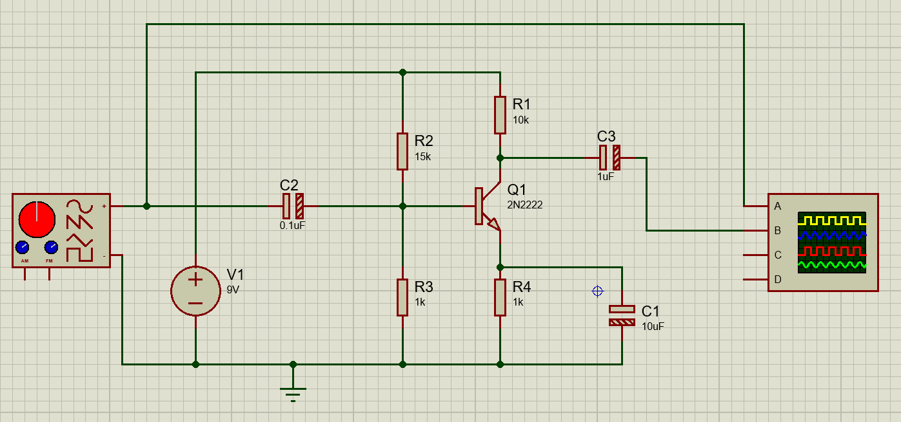
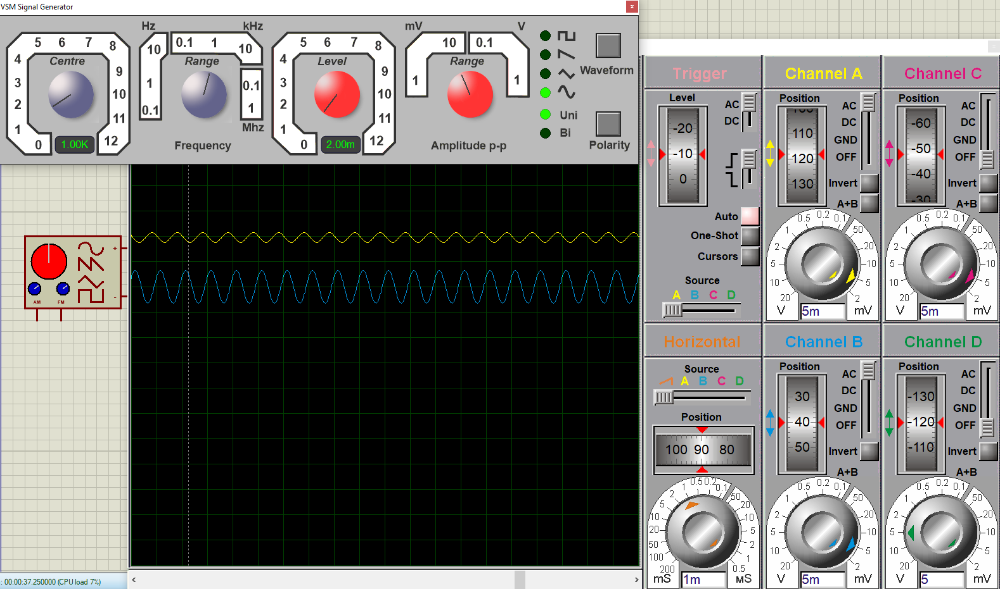
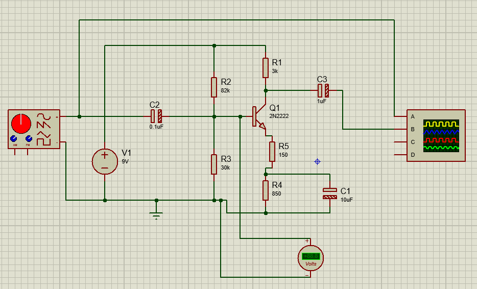
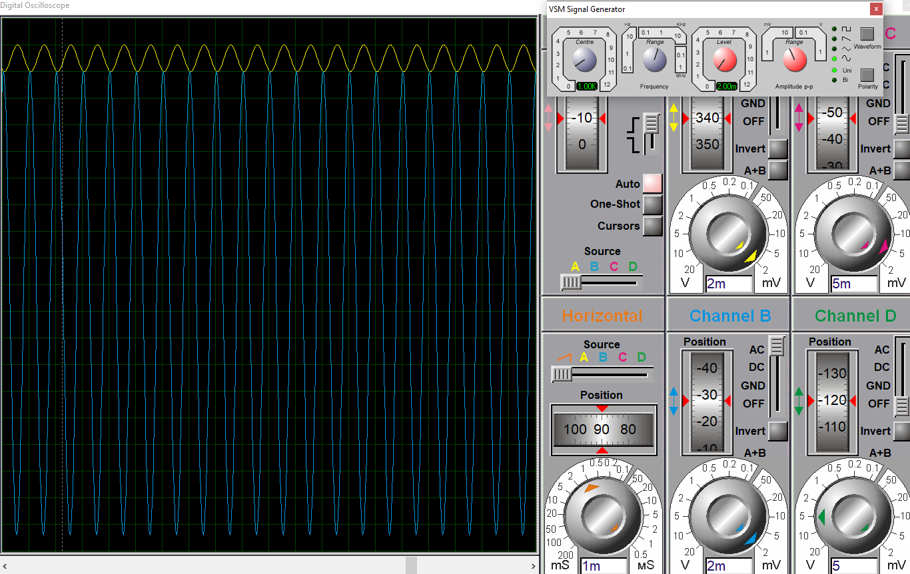

# Basic-Class-A-Amplifier
This is a basic circuit Class A common emitter amplifier with its documentation which means its formulas. 

A small-signal Class A audio preamplifier designed using a 2N2222 BJT transistor in a common emitter configuration with voltage divider biasing. This project covers the complete workflow from theoretical mathematical design to real-time simulation and optimization.

This project started with a circuit I found in the internet which looks like this when simulated in proteus.

Take into account that the input signal in the original circuit was a microphone. Also here is how the oscilloscope looked with these values.

---

Soon I realized that the values were not helping for amplification, this because when taking a look at the voltage divider

$$V_{out} = V_{in} \cdot \frac{R_2}{R_1 + R_2}$$

$$V_{out} = 9 \cdot \frac{1k}{15k + 1k}$$

$$V_{out} = 0.562V$$

Which is not even enough to get through the transistor, which normally take about 0.7v to get to the active region. Thus some calculations were made.

---

## 📊 Circuit Design & Progression

### Direct Current (DC) Analysis
To ensure thermal stability, the emitter voltage ($V_E$) was set at 15% of $V_{CC}$ ($1.5\text{V}$). Assuming a $\beta = 200$, the base bias network was calculated to establish a stable quiescent point ($Q$-point) right at the center of the load line ($V_C = 4.5\text{V}$) to avoid clipping.

* **$R_1$ (Base to $V_{CC}$):** $82\text{ k}\Omega$
* **$R_2$ (Base to GND):** $30\text{ k}\Omega$
* **$R_C$ (Collector):** $3\text{ k}\Omega$

### Alternating Current (AC) Optimization and Split-Emitter
Initially, a single 1k emitter resistor yielded a low voltage gain ($A_v = 3$). Bypassing the entire resistor with a capacitor caused extreme signal distortion due to the transistor's internal dynamic resistance ($r'_e$).

Initially a capacitor in parallel with the 1k resistor was thought, but the gain increased so much that it would have lost fidelity.

**The Solution:** In order to get more gain the solution was something called **split-emitter** configuration, that allows to control AC gain independently without disrupting the DC bias point:
* **$R_5$ (Unbypassed):** $150\ \Omega$ (Sets the precise AC degenerative feedback).
* **$R_4$ (Bypassed by $C_1 = 10\mu\text{F}$):** $850\ \Omega$.

**If you would like to take a look at a more detailed explanation of how I got these values take a look at the documentation folder of this project**
---
After the calculations here is how the circuit and its signal look

